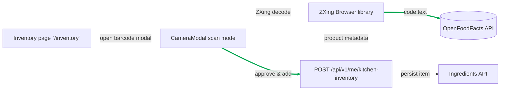
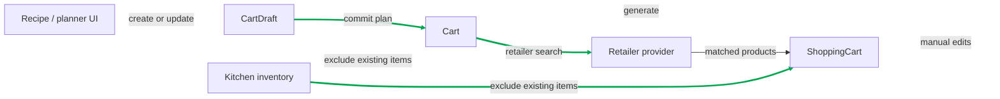
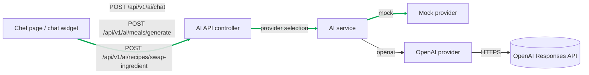
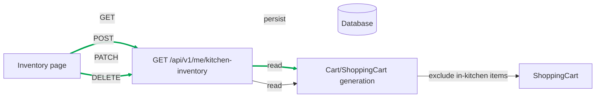
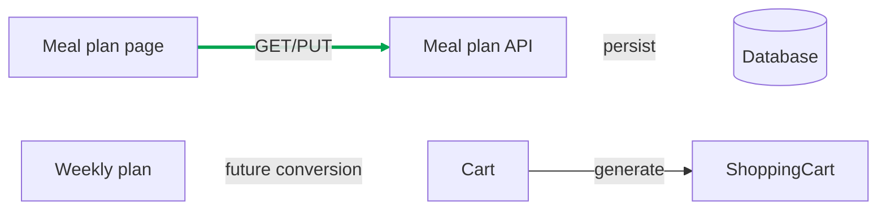

# Chef System Flow Design

This document captures the current implementation and architecture for:

- Barcode scanning
- Shopping Cart
- LLM / OpenAI
- Inventory
- Shopping Plan (Meal Plan)

Each section includes the UI entrypoints, API routes, system design, and a separate Mermaid diagram.

---

## 1. Barcode Scanning

### Current UI flow

- Page: `/inventory`
- Component: `apps/web/src/app/inventory/inventory-client.tsx`
- Button: `Barcode`
- Modal: `apps/web/src/app/inventory/camera-modal.tsx`
- Mode: `scan`

When the user opens the barcode scanner:

1. `CameraModal` requests camera access via `navigator.mediaDevices.getUserMedia`.
2. If `mode === "scan"`, it dynamically imports `@zxing/browser` and `@zxing/library`.
3. ZXing decodes barcodes from the live video stream.
4. On successful scan, the app calls OpenFoodFacts directly:
   - `https://world.openfoodfacts.org/api/v0/product/${barcode}.json`
5. The product result is rendered inside the modal.
6. If the user accepts it, `addInventoryItemAction(product.name)` is called.

### Current system/API flow

- Client-side fetch: OpenFoodFacts
- Internal API: `POST /api/v1/me/kitchen-inventory`
- Backend controller: `apps/api/src/ingredients/ingredients.controller.ts`
- Backend service: `apps/api/src/ingredients/ingredients.service.ts`

The inventory add action is implemented in:

- `apps/web/src/app/inventory/actions.ts`

This means barcode scanning currently has two distinct paths:

- client-side barcode decode + external lookup
- authenticated backend inventory persistence

### Why this matters

Current design is simple, but brittle:

- barcode lookup is done on the client and bypasses the backend
- OpenFoodFacts results are not normalized in the product data pipeline
- there is no backend caching, deduplication, or enrichment step before inventory creation
- a failed lookup still adds the raw barcode string as inventory name if no product is found

### Recommended design improvement

Ideal system design would shift the barcode lookup into a backend boundary:

- client scans barcode and sends only the code to backend
- backend handles provider lookup, caching, catalog normalization, and fallback metadata
- backend resolves a canonical ingredient/brand and returns a small product summary
- frontend lets the user confirm/override the final inventory label

That would make barcode scanning more robust and better integrated with inventory and recipe matching.

### Barcode scanning diagram



---

## 2. Shopping Cart

### Current UI callers

- Recipe detail / Add to cart flows (documented in `README.md`)
- Cart builder overlay
- `/shopping` saved cart library
- Inventory page quick restock via `Add All to Cart`

The inventory restock button does:

- `createRestockCartAction(names)`
- `POST /api/v1/carts/restock`
- redirects to `/shopping`

### Core resources

The current backend model is intentionally split into three resources:

- `CartDraft` — editable, incomplete planning intent
- `Cart` — stable recipe-based meal plan snapshot with retailer context
- `ShoppingCart` — retailer-facing purchase basket derived from a `Cart`

### Current API routes

- `POST /api/v1/cart-drafts`
- `PATCH /api/v1/cart-drafts/:id`
- `GET /api/v1/cart-drafts`
- `DELETE /api/v1/cart-drafts/:id`

- `POST /api/v1/carts`
- `PATCH /api/v1/carts/:id`
- `GET /api/v1/carts`
- `GET /api/v1/carts/:id`
- `GET /api/v1/carts/:id/ingredient-review`
- `PUT /api/v1/carts/:id/ingredient-review`

- `POST /api/v1/carts/:cartId/shopping-carts`
- `GET /api/v1/shopping-carts`
- `GET /api/v1/shopping-carts/history`
- `GET /api/v1/shopping-carts/:id`
- `PATCH /api/v1/shopping-carts/:id`

- `GET /api/v1/retailers/:retailer/products/search`

### Key design points

- `Cart` is not the final purchase basket. It is a plan snapshot.
- `ShoppingCart` is the derived retailer-matched basket.
- Shopping-cart generation skips items that are already marked `in_kitchen`.
- Manual shopping-cart edits are persisted via `PATCH /api/v1/shopping-carts/:id`.
- `carts/restock` is a convenience path for inventory-driven shopping creation.

### Recommended improvement

The current flow is good on separation, but the UI should make the distinction clearer:

- `Cart` = "what I plan to cook"
- `ShoppingCart` = "what I am buying"

A better implementation would enforce this separation visually and reduce coupling:

- keep `Cart` creation independent from retail matching
- generate `ShoppingCart` only after user confirms retailer and inventory review
- keep manual edits on `ShoppingCart` behind the same persistence boundary

### Shopping cart diagram



---

## 3. LLM / OpenAI

### Current API endpoints

- `GET /api/v1/ai/status`
- `POST /api/v1/ai/chat`
- `POST /api/v1/ai/meals/generate`
- `POST /api/v1/ai/recipes/swap-ingredient`
- `POST /api/v1/ai/recipe-imports/structure`

### Current implementation

- Backend module: `apps/api/src/ai/`
- Controller: `apps/api/src/ai/ai.controller.ts`
- Service: `apps/api/src/ai/ai.service.ts`
- Provider boundary:
  - `MockAiProvider`
  - `OpenAiAiProvider`
- Env var: `CHEF_LLM_PROVIDER`
- OpenAI model env: `OPENAI_MODEL`

### OpenAI provider behavior

- Uses `https://api.openai.com/v1/responses`
- Sends a Chef system prompt and JSON payload
- Requests `json_schema` output with strict schema
- Uses the configured `OPENAI_API_KEY`

### Frontend callers

- `apps/web/src/components/ai/chef-chat-widget.tsx`
- `apps/web/src/app/chef-ai/chef-ai-client.tsx`
- Future meal/recipe generate UI surfaces

### Design principle

The current design is intentionally narrow:

- LLMs generate/edit structured recipes and meal previews
- LLMs do not perform final product matching or subtotal math
- Deterministic services own cart aggregation, inventory filtering, and retailer matching

### Recommended improvement

Keep the LLM boundary as a structured reasoning layer, not a shopping executor.
Ideal implementation:

- use AI for meal/recipe intent, ingredient structure, and substitutions
- use backend deterministic pipelines for cart generation and retailer resolution
- enrich chat context over time with recipe, inventory, cart, and plan state

### LLM diagram



### LLM Input/Output Details

#### Communications with LLM

The system communicates with OpenAI's Responses API for all AI features:

1. **Chat** (`POST /api/v1/ai/chat`) - Conversational cooking assistance
2. **Meal Generation** (`POST /api/v1/ai/meals/generate`) - Generate recipe previews from prompts
3. **Ingredient Swap** (`POST /api/v1/ai/recipes/swap-ingredient`) - Propose ingredient substitutions
4. **Recipe Import** (`POST /api/v1/ai/recipe-imports/structure`) - Structure recipes from URLs

#### What is sent to the LLM

All requests follow the same format:

- **System Prompt**: Fixed Chef assistant prompt (see `SYSTEM_PROMPT` in `openai-ai.provider.ts`)
- **User Message**: JSON payload with `{ task: string, payload: object }`
- **Output Schema**: Strict JSON schema for structured responses

**For Chat:**

```json
{
  "task": "Answer the user as a concise cooking, meal prep, ingredient, recipe, and Chef workflow assistant. Use context when provided.",
  "payload": {
    "message": "What can I cook with rice and eggs?",
    "history": [
      { "role": "user", "content": "Previous message" },
      { "role": "assistant", "content": "Previous response" }
    ],
    "context": {
      "page": "/recipes",
      "surface": "global_chef_chat_widget",
      "hands_free_mode": false,
      "selected_context_type": "recipe",
      "selected_context_name": "Arroz con pollo",
      "selected_context_detail": "Selected recipe details"
    }
  }
}
```

**For Meal Generation:**

```json
{
  "task": "Generate structured recipe preview data from the meal request. Respect dietary preferences, allergies, inventory, budget mode, meal quantity, and quality goals.",
  "payload": {
    "meal_prompt": "Cheap high-protein burrito bowls for weekday lunches",
    "servings_per_meal": 4,
    "meals_needed": 5,
    "dietary_preferences": ["high protein", "halal"],
    "allergies": ["peanuts"],
    "disliked_ingredients": ["mushrooms"],
    "inventory": ["rice", "olive oil", "garlic"],
    "budget_mode": "minimize_cost",
    "meal_style": "meal_prep",
    "max_time_minutes": 45,
    "max_cost_per_serving": 5,
    "quality_goals": ["filling", "reheats well", "not bland"],
    "notes": "Use ingredients available in a normal US grocery store."
  }
}
```

#### What is sent as context to LLM

**Chat Context:**

- `page`: Current URL path (e.g., "/recipes", "/inventory")
- `surface`: UI surface identifier (e.g., "global_chef_chat_widget_expanded")
- `hands_free_mode`: Boolean indicating hands-free cooking mode
- `selected_context_type`: Type of selected item ("none", "recipe", "generated", "imported")
- `selected_context_name`: Name of selected recipe/item
- `selected_context_detail`: Additional details about selection

**Recipe Generation Context:**

- All parameters from `GenerateMealsDto`: dietary preferences, allergies, inventory, budget constraints, etc.
- The frontend server action `generateMealsAction` enriches generation requests
  with authenticated `/me/profile-memory` and `/me/kitchen-inventory` data
  before calling `POST /api/v1/ai/meals/generate`.
- Caller-provided fields such as modal dietary chips are merged with saved
  preferences and inventory. Explicit caller values remain part of the
  structured payload rather than being flattened only into `notes`.
- No page context - focused on meal requirements.

#### What comes back from LLM

All responses are structured JSON conforming to schemas in `ai.schemas.ts`:

**Chat Response:**

```json
{
  "message": "You can make a simple fried rice dish...",
  "follow_up_prompts": [
    "How many servings?",
    "Any dietary restrictions?",
    "What other ingredients do you have?"
  ],
  "safety_notes": ["Ensure eggs are fully cooked", "Check for allergies"]
}
```

**Meal Generation Response:**

```json
{
  "summary": "High-protein burrito bowls using your inventory",
  "recipes": [
    {
      "name": "Chicken Burrito Bowl",
      "cuisine": "Mexican-American",
      "description": "Protein-packed bowl with rice and beans",
      "servings": 4,
      "ingredients": [...],
      "steps": [...],
      "tags": ["high-protein", "meal-prep"],
      "nutrition_estimate": {...},
      "estimated_cost_tier": "budget",
      "cost_notes": [...],
      "quality_tradeoffs": [...],
      "assumptions": [...]
    }
  ],
  "inventory_used": ["rice", "garlic"],
  "cost_minimization_notes": [...],
  "planning_notes": [...]
}
```

#### Hands-Free Mode

When hands-free mode is enabled in chat:

- Same AI service (OpenAI or mock) handles requests
- Context includes `"hands_free_mode": true`
- User messages get suffix: `"Respond briefly and in a hands-free cooking style."`
- Follow-up prompts switch to hands-free specific options
- Responses are more concise and step-by-step focused

#### Recipe Generation Context

Recipe generation receives comprehensive context:

- User prompt describing desired meal
- Servings per meal and number of meals needed
- Dietary preferences and restrictions
- Available inventory to prioritize
- Budget and time constraints
- Quality goals and notes
- No page context - purely meal-focused

### LLM Input/Output Flow Diagram

```mermaid
flowchart TD
  subgraph "Frontend Input"
    ChatInput[Chat Message + History + Context]
    MealInput[Meal Prompt + Preferences + Inventory]
  end

  subgraph "API Layer"
    ChatAPI[POST /ai/chat]
    MealAPI[POST /ai/meals/generate]
  end

  subgraph "Backend Processing"
    Service[AI Service]
    Provider[AI Provider<br/>OpenAI/Mock]
  end

  subgraph "LLM Request"
    System[System Prompt<br/>"You are Chef's food assistant..."]
    Task[Task Description]
    Payload[Structured Payload<br/>JSON]
    Schema[JSON Schema<br/>for Response]
  end

  subgraph "LLM Response"
    StructuredOutput[Structured JSON<br/>Response]
  end

  subgraph "Frontend Output"
    ChatResponse[Chat Message + Follow-ups + Safety Notes]
    MealResponse[Recipe Previews + Summary + Notes]
  end

  ChatInput --> ChatAPI
  MealInput --> MealAPI
  ChatAPI --> Service
  MealAPI --> Service
  Service --> Provider
  Provider --> System
  Provider --> Task
  Provider --> Payload
  Provider --> Schema
  Schema --> StructuredOutput
  StructuredOutput --> ChatResponse
  StructuredOutput --> MealResponse

  linkStyle 0 stroke:#00a550,stroke-width:3
  linkStyle 1 stroke:#00a550,stroke-width:3
  linkStyle 2 stroke:#ffffff,stroke-width:2
  linkStyle 3 stroke:#ffffff,stroke-width:2
  linkStyle 4 stroke:#ffffff,stroke-width:2
  linkStyle 5 stroke:#ffffff,stroke-width:2
  linkStyle 6 stroke:#ffffff,stroke-width:2
  linkStyle 7 stroke:#ffffff,stroke-width:2
  linkStyle 8 stroke:#ffffff,stroke-width:2
  linkStyle 9 stroke:#00a550,stroke-width:3
  linkStyle 10 stroke:#00a550,stroke-width:3
```

---

## 4. Inventory

### Current inventory UI

- Page: `/inventory`
- Component: `apps/web/src/app/inventory/inventory-client.tsx`
- Supports:
  - manual Add
  - barcode scan
  - quantity/unit editing
  - remove item
  - quick restock cart

### Backend inventory API

- `GET /api/v1/me/kitchen-inventory`
- `POST /api/v1/me/kitchen-inventory`
- `PATCH /api/v1/me/kitchen-inventory/:id`
- `DELETE /api/v1/me/kitchen-inventory/:id`

### Inventory semantics

- `KitchenInventoryItem` is a user-scoped kitchen item
- It is user-declared, not automatically inferred
- It can store `estimated_amount` and `unit`
- It can be matched to canonical ingredients, but it is intentionally flexible

### Cart interaction

- Cart overview enrichment reads inventory rows via canonical ingredients.
- Shopping-cart generation skips ingredients already marked `in_kitchen`.
- Quick restock from inventory uses `POST /api/v1/carts/restock`.

### Recommended improvement

The current inventory layer is a strong foundation. Key next steps:

- make barcode and vision inventory addition clearly review-first
- use a shared ingredient catalog when possible
- preserve unresolved inventory item names separately from canonical ingredient IDs
- keep inventory edits and cart deductions explicit rather than automatic

### Inventory diagram



---

## 5. Shopping Plan / Meal Plan

### Current UI flow

- Page: `/meal-plan`
- Component: `apps/web/src/app/meal-plan/meal-plan-client.tsx`
- Page actions: `apps/web/src/app/meal-plan/actions.ts`
- Meal plan render: `apps/web/src/components/meal-plan.tsx`

### Backend API

- `GET /api/v1/meal-plans?week_start=YYYY-MM-DD`
- `PUT /api/v1/meal-plans?week_start=YYYY-MM-DD`

### Current design

- Weekly meal plans are persisted per user and week start.
- Each plan includes 7 days and recipe references for breakfast/lunch/dinner.
- The meal plan layer is intentionally separate from cart generation.
- The current implementation does not create `Cart` records automatically.

### Recommended system design

- Keep weekly meal plans as an intent layer, not a shopping basket.
- Add a conversion path later:
  - meal plan -> selected recipes -> `Cart`
  - then `Cart` -> `ShoppingCart`
- Avoid collapsing meal plans directly into shopping carts today.

### Meal plan diagram



---

## 6. Connection status guide

- Green lines: ideal connections / strong design
  - LLM -> structured recipe preview only
  - Cart -> ShoppingCart separation
  - Inventory -> cart deduction by canonical ingredient
  - backend barcode lookup boundary

- White lines: normal current flows
  - frontend inventory CRUD
  - meal plan UI persistence
  - shopping-cart API read/write

- Red lines: inconvenient or fragile connections
  - client-side barcode lookup directly to OpenFoodFacts
  - shopping-cart generation coupled too early to inventory state
  - meal plan not yet connected to carts and grocery execution

---

## 7. Notes and references

Files referenced in this document:

- `apps/web/src/app/inventory/inventory-client.tsx`
- `apps/web/src/app/inventory/camera-modal.tsx`
- `apps/web/src/app/inventory/actions.ts`
- `apps/api/src/ingredients/ingredients.controller.ts`
- `apps/api/src/cart/cart.controller.ts`
- `apps/api/src/meal-plan/meal-plan.controller.ts`
- `apps/api/src/ai/ai.controller.ts`
- `apps/api/src/ai/ai.service.ts`
- `apps/api/src/ai/providers/openai-ai.provider.ts`
- `docs/vision-scan-lab.md`
- `docs/architecture.md`
- `docs/llm-mechanism.md`
